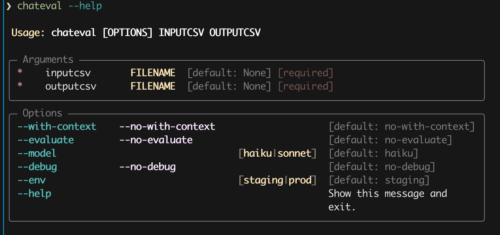

# chateval

A simple commandline tool to evaluate nuldc's chat-based search.

## Installation

```bash 
## install chat eval
pip install git+https://github.com/nulib-labs/chateval.git
```

## Pre-requisites 

Set your aws profile and login: 

```bash
export AWS_PROFILE=your-sso-profile
aws sso login
```

## Usage 


